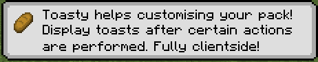

# Toasty

Toasty is a Minecraft Mod that allows you to display toasts after certain events happen in game.



Toasty is fully clientside.

## Adding custom toasts

A custom toast can be added using a resourcepack and placing a JSON file under `assets/<namespace>/toasts`.

A toast file looks like this:

```json5
{
  "toast": {
    "factory": {
      //optional, defaults to true
      "display_once": true,
      //optional, defaults to 5000, or 5 secs
      "display_time_in_milliseconds" : 5000,
      //The item to display on the left corner
      "item": "minecraft:bread",
      
      //Text and title are required Component fields. This means they can be translated,
      //colored and styled just like any other text you can see in game.
      "text": "Display toasts after certain actions are performed. Fully clientside!",
      "title": "Toasty helps customising your pack!"
    },
    //As of now, only this factory exists
    "toast_factory": "toasty:simple"
  },
  //A toast source is the way through which a player sees the Toast.
  //A toast source's targets are heavily dependant on the source.
  "toast_source": [
    {
      "source_id": "toasty:first_login",
      "targets": ["toasty:first_login"]
    }
  ]
}
```

### Toast Factories
As of now, the only type of factory enabled is `toasty:simple`.

### Toast Sources

- `toasty:on_login` - Displays the toast when logging into a world. Requires a non-empty `targets` list. 
- `toasty:item_pickup` - Displays the toast after picking up an item in the world. A target is the ResourceLocation that identifies the item. For example, `minecraft:iron_pickaxe`.
- `toasty:entity_kill` - Displays the toast after killing a certain entity type. A target is the ResourceLocation that identifies the entity type. For example, `minecraft:chicken`.

## Saved locations

Toasty is fully clientside and uses the `toasty` folder at the root of your minecraft instance to keep 
track of the toasts you have seen throughout your playthrough.

## Future plans

- A screen to create toasts in game.
- CraftTweaker support